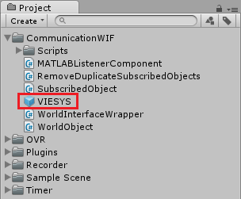

Adding data collection to your own scene
^^^^^^^^^^^^^^^^^^^^^^^^^^^^^^^^^^^^^^^^
Now that you have familiarized yourself with the :doc:`sample scene<sample_scene>`, you can implement data collection into your own scene.

Save data to file
-----------------
The section below describes how to save data to file. For output data format, please refer to ``DOCUMENTATION``.

Main Scripts (other experimental scripts are listed in ``DOCUMENTATION``):
  * MainRecorder_
  * RecordAudioSources_
  * RecordInputJoystick_
  * RecordGameInfo_
  * AudioWAVRecorder_
  * RecordPositionAttach_
	

MainRecorder GameObject
"""""""""""""""""""""""
The first step is to create the ``MainRecorder`` GameObject. This can be conveniently done by dragging the ``MainRecorder`` prefab (blue box icon) from the ``Recorder`` assets folder into the Hierarchy.

The MainRecorder comes with several script components attached.

MainRecorder
++++++++++++
The ``MainRecorder`` script handles the save directory. Its parameters are:
	- Save Directory: The path of the directory where the data will be output. This can either be absolute or relative to the project root folder. Use ``..`` to navigate up in the directory tree.
	- Local Path: Specifies whether the path in `Save Directory` is local (relative to the project root folder) or absolute.
	- Additional Name: An additional string that will be added to the data output folders. For example, this can be set to the subject's name or ID. In the most typical implementation, however, this value will be set and overwritten by MATLAB when the game is started.
	
RecordAudioSources
++++++++++++++++++
The ``RecordAudioSources`` script creates two separate files:

- one file saving every time an audio clip starts playing, and
- one file saving every time the volume of an audio clip perceived by the player changes (for example if the distance between the player and the source changes).

The variable ``LogNumberPlaying``, if set to true (checked), will write to console the number of audio sources playing every frame. **This should only be used for debugging purposes, as it might slow down the simulation.**

RecordInputJoystick
+++++++++++++++++++
The ``RecordInputJoystick`` script records input from the controller. It creates one file for the recorded axes and one for the recorded buttons.

The ``Buttons To Record`` menu contains the list of the buttons that should be recorded. By default, all buttons are recorded, but it is possible to remove any of them.

The ``Axes To Record`` menu contains the list of the axes that should be recorded. By default, all axes are recorded, but it is possible to remove any of them.

The ``Save Axis Change Only`` checkbox specifies whether axes values should be recorded only when they change or every frame.

RecordGameInfo
++++++++++++++
The ``RecordInputJoystick`` script records general game information. Please refer to ``DOCUMENTATION!`` to learn how to implement recording of features.

AudioWAVRecorder
++++++++++++++++
The ``AudioWAVRecorder`` script records the audio perceived by the player (``AudioListener``).

If the ``Record WAV`` checkbox is enabled, the audio will be saved to a ``.wav`` file.

If the ``Record TXT`` checkbox is enabled, the audio data will be saved to a ``.txt`` file. Please refer to ``DOCUMENTATION!!!`` for more information.

**NOTE:** This script has known issues and does not record *all* sounds being played. Please test the script on your project and see if it works for you.

.. _RecordPositionAttach:

Record Object Position: RecordPositionAttach
""""""""""""""""""""""""""""""""""""""""""""
To record the position and rotation of a GameObject, add the ``RecordPositionAttach`` script (found in the ``Recorder`` assets folder) to its components.

The ``Save Object Scale`` checkbox specifies whether the object's scale should be recorded.

The ``Only Save Change`` checkbox specifies whether the position and rotation data should only be saved when any one of the (position or rotation) coordinates changes.

The ``Record Local`` checkbox specified whether the position and rotation of the object should *also* be recorded respective to its parent GameObject. For example, this might be required for ``CenterEyeAnchor``, as local position and rotation give the player's head position and rotation in the real world.

Send data over network
----------------------

VIESYS GameObject
"""""""""""""""""
The first step is to create the ``VIESYS`` GameObject. This can be conveniently done by dragging the ``VIESYS`` prefab (blue box icon) from the ``CommunicationWIF`` assets folder into the Hierarchy.

The VIESYS GameObject comes with various script components attached.

The ``WorldInterfaceWrapper`` script is the backbone of the communication with MATLAB. The ``Start Paused`` checkbox specifies whether the game should start paused.

The ``MATLABListenerComponent`` script exposes some functionalities primarily intended for debugging. Refer to ``DOCUMENTATION`` for more information.

.. 
  * The ``Start Listening`` button sets Unity to listen to incoming commands from MATLAB, in case this had been turned off before (Unity is listening by default). The current listening status is displayed above the buttons.
  * The ``Stop Listening`` button makes Unity stop listening to incoming commands from MATLAB while the game is not running. It is not possible to disable listening while the game is running, unless this is done by disabling the ``WorldInterfaceWrapper`` script altogether.
  * The ``Reload WorldInterface`` button reloads the WorldInterface instance.
  * The ``Unsubscribe All`` button clears the list of subscribed objects. Use this if the console keeps printing ``MissingReferenceException``.
  * The ``Report End of Game`` button sends an `End of Game` message to MATLAB.
  * The ``Report Current Scene`` button sends a message to MATLAB containing the path of the current scene file relative to the project root folder.
  
The ``RemoveDuplicateSubscribedObjects`` button removes duplicate subscribed objects attached to the same GameObject (as they are not required). This is only intended for debugging purposes.

Track object position: WorldObject
""""""""""""""""""""""""""""""""""
To track the position and rotation of a GameObject and send it to MATLAB, add the ``WorldObject`` script (found in the ``CommunicationWIF`` assets folder) to its components. If the object has been **SUBSCRIBED!!! (link)** from MATLAB, a message will be sent every time the position or rotation of the object has changed.

Use the ``Id`` field to specify the name by which MATLAB will refer and subscribe to the GameObject that has this script attached.
Use the ``Property1`` field to send a generic message to MATLAB. The field will be cleared once the message has been sent. You will need to implement your own protocol to send messages through the ``Property1`` field and decode them in MATLAB.
