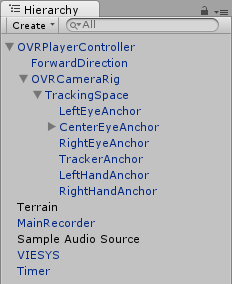

Sample scene
^^^^^^^^^^^^
Before implementing data collection in your project, you might want to become more familiar with it by looking at a sample scene that includes all the existing functionalities.

To open the sample scene, navigate to the ``Sample Scene`` folder and double click the sampleScene file with a Unity icon.

The Hierarchy view contains several game objects. 

* The ``MainRecorder`` GameObject manages the data output to file. The scripts attached to it save general game properties to file (i.e. properties that are not dependent on a single GameObject), such as audio sources, controller input, game information, etc.
* The ``VIESYS`` GameObject manages the communication with MATLAB.
* The ``OVRPlayerController > OVRCameraRig > TrackingSpace > CenterEyeAnchor`` GameObject has a ``RecordPositionAttach`` script attached to itself, which saves position and rotation data for this GameObject to file.
* The ``OVRPlayerController > OVRCameraRig > TrackingSpace > CenterEyeAnchor`` GameObject also has a ``WorldObject`` script attached to itself, which allows communication with MATLAB.
* The ``Sample Audio Source`` GameObject contains an Audio Source which will generate a sound as the game is started.
* The ``Timer`` GameObject contains a countdown timer.

For further information, please visit ``DOCUMENTATION!!!!``
